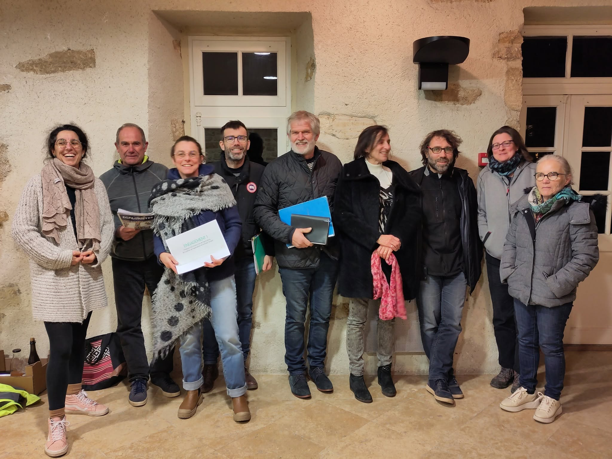

= Baie Vivante et Solidaire
:showtitle:
:page-title: Baie Vivante et Solidaire
:page-description: Baie Vivante et Solidaire est une association du territoire de la Baie du Cotentin

Baie Vivante et Solidaire est une association du territoire de la Baie du Cotentin

== Baie Vivante et Solidaire

Notre Association Citoyenne est née d’un collectif d’habitants du territoire de la Baie Du Cotentin suite à l’annonce de la collectivité de soutenir sans réserve un projet privée d’aménagement touristique majeur sans avoir organisé au préalable une consultation auprès des habitants du territoire

== Qui sommes-nous ?

L’association a pour but de communiquer, informer, sensibiliser sur les projets considérés par l’association comme devant être portés à la connaissance et à l’approbation du public pour des raisons éthiques, culturelles, environnementales et économiques.
